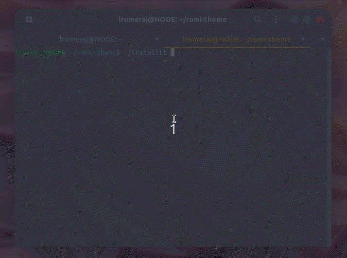
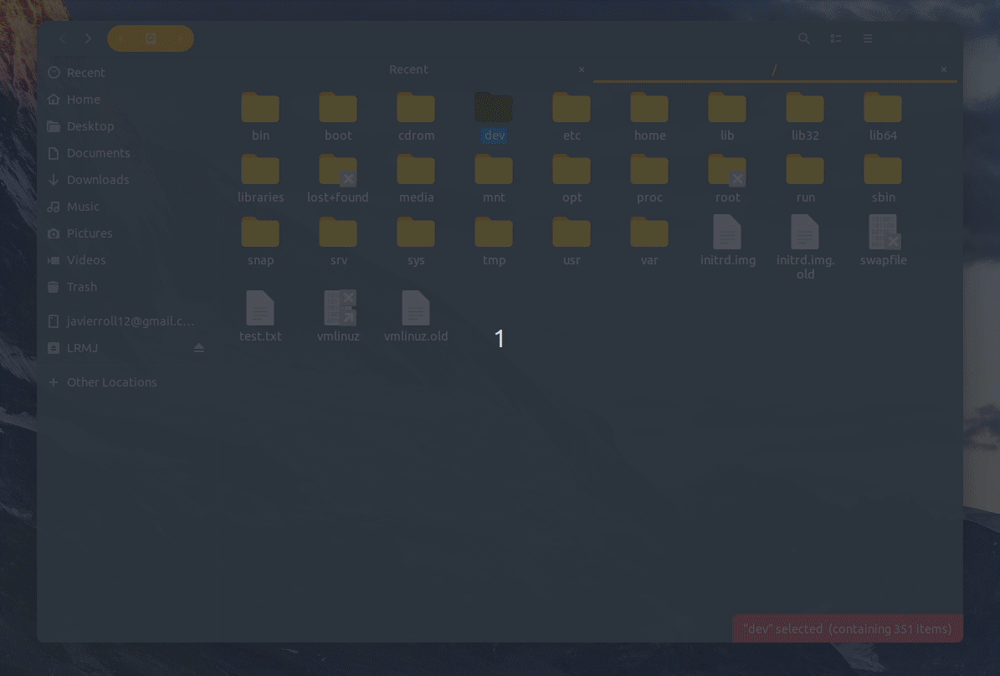
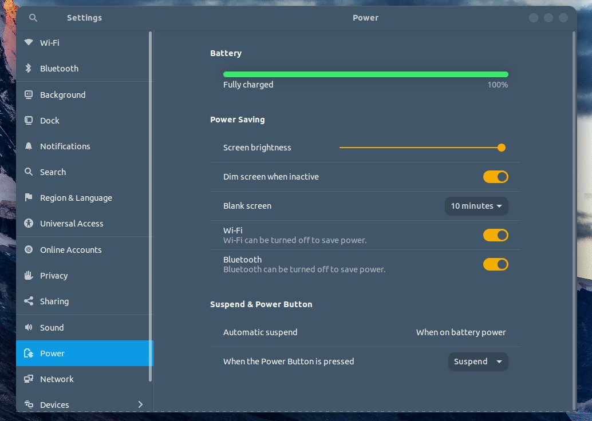
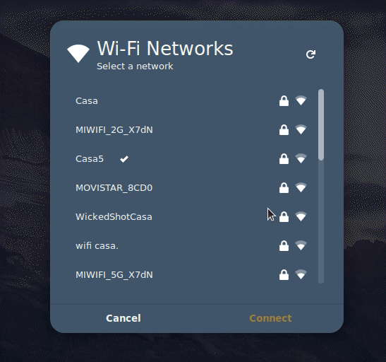
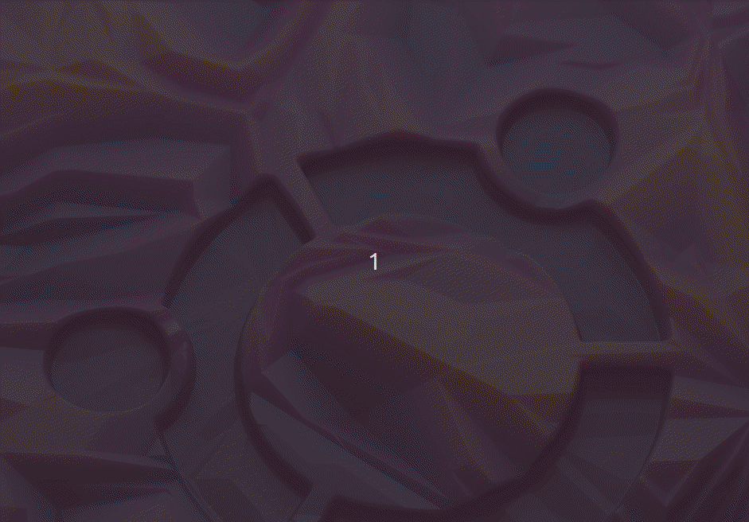

# Romi Theme

## Note
Romi theme **only supports** (by the moment) **Ubuntu 19.10 (Eoan Ermine)** and **Ubuntu 19.04 (Disco Dingo)**.

## Last changes v1.4 | 22/12/2019 20:30
`[FIXES]`
- Fixed a bug that was causing desktop overlapping.
- Fixed theme styling that was hiding search results.

`[INSTALLER]`
- Improved extension management.
- Installer will use now the new `gnome-extensions` manager.

`[EXTENSIONS]`
- Updated all extensions to the latest version.

`[THEME]`
- New nature backgrounds.
- Changed style of some decoration bars.
- Changed selection color of desktop's icons.
- Default desktop extension `desktop-icons@csoriano` was improved.

`[UPCOMING]`
- Theming improvements.
- Theme uninstaller.

## Install
Romi theme comes with a dynamic installer that will make everything fast and easy.

### Steps
1. Clone the repo
```
$ git clone https://github.com/lromeraj/romi-theme
```
2. Enter directory
```
$ cd romi-theme
```
3. Time to execute installer
```
$ ./installit
```
In a few seconds you'll be enjoying the theme...



> NOTE: after theme installation a reboot is recommended.

## Preview











## Customization

### Backgrounds

The installer will look for ```gdmlock.jpg``` and ```desktop.jpg```
inside ```wallpapers/``` folder, if installer does not find anything,
it will look for the same files inside ```/usr/share/backgrounds/```
else the installer will use your own custom backgrounds.

> gdmlock.jpg => lock screen background

> desktop.jpg => desktop background

If the installer finds ```gdmlock.jpg``` and ```desktop.jpg``` inside
```/usr/share/backgrounds/``` **it will not do anything with the wallpapers**,
else the installer will copy the default theme's backgrounds.

> NOTE: it is important that the name of the files has to match exactly as indicated above.
