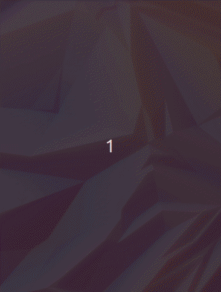

# Romi Theme

## Note
Romi theme **only supports** (by the moment) **Ubuntu 19.10 (Eoan Ermine)** and **Ubuntu 19.04 (Disco Dingo)**.

## Last changes v1.3 02/11/2019 17:15
`[NEW]`
- Support for Ubuntu `19.10`.
- Updated `dconf`.

`[THEME]`
- Improved terminal color contrast.

`[ICONS]`
- Updated `Numix` icons to the latest version.

`[EXTENSIONS]`
- Updated all extensions to the latest version to support Gnome `3.34`.
- Changed desktop extension to `desktop-icons@csoriano` to `ding@rastersoft.com`.

`[INSTALLER]`
- Improved isntaller stability
- The installer now checks the OS version to avoid compatibility issues.
- If you come from Ubuntu 19.04 (Disco Dingo), the installer will remove the obsolete extensions to avoid corruptions.

`[FIXES]`
- Now you can drag and drop from Desktop to Nautilus file manager.
- Fixed error that caused icons to not load properly.

`[UPCOMING]`
- Theme uninstaller.

## Install
Romi theme comes with a dynamic installer that will make everything fast and easy.

### Steps
1. Clone the repo
```
$ git clone https://github.com/lromeraj/romi-theme
```
2. Enter directory
```
$ cd romi-theme
```
3. Time to execute installer
```
$ ./installit
```
In a few seconds you'll be enjoying the theme...


> NOTE: after theme installation a reboot is recommended.

## Preview




## Customization

### Backgrounds

The installer will look for ```gdmlock.jpg``` and ```desktop.jpg```
inside ```wallpapers/``` folder, if installer does not find anything,
it will look for the same files inside ```/usr/share/backgrounds/```
else the installer will use your own custom backgrounds.

> gdmlock.jpg => lock screen background

> desktop.jpg => desktop background

If the installer finds ```gdmlock.jpg``` and ```desktop.jpg``` inside
```/usr/share/backgrounds/``` **it will not do anything with the wallpapers**,
else the installer will copy the default theme's backgrounds.

> NOTE: it is important that the name of the files has to match exactly as indicated above.
